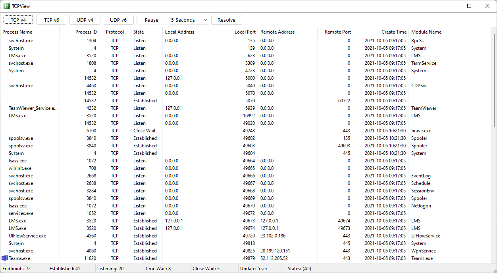
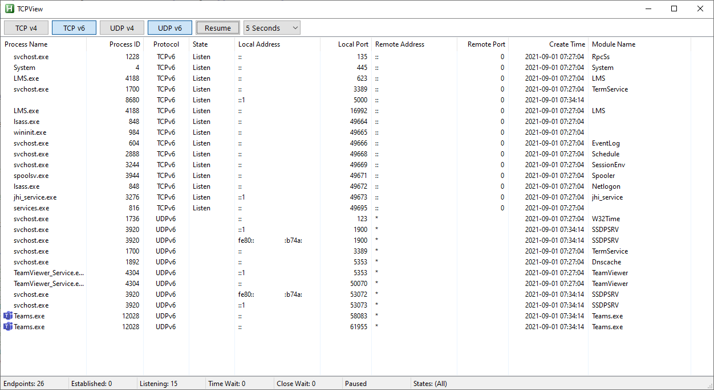

# TCPView
 Shows TCP and UDP connections.

## Features
* Shows TCP (v4 and v6) connections.
* Shows UDP (v4 and v6) connections.
* Resolves Remote IP to Hostname
* Export as .csv

## Examples

## Contributing
* thanks to Bentschi for NetStat()
* thanks 'just me' for DnsQuery()
* thanks to swagfag
* thanks to AutoHotkey Community

## Inspired by
[TCPView](https://docs.microsoft.com/en-us/sysinternals/downloads/tcpview) by Mark Russinovich (Sysinternals)

## Questions / Bugs / Issues
If you notice any kind of bugs or issues, report them on the [AHK Thread](https://www.autohotkey.com/boards/viewtopic.php?t=94333). Same for any kind of questions.

## Copyright and License
[MIT License](LICENSE)

## Donations
[Donations are appreciated if I could help you](https://www.paypal.me/smithz)